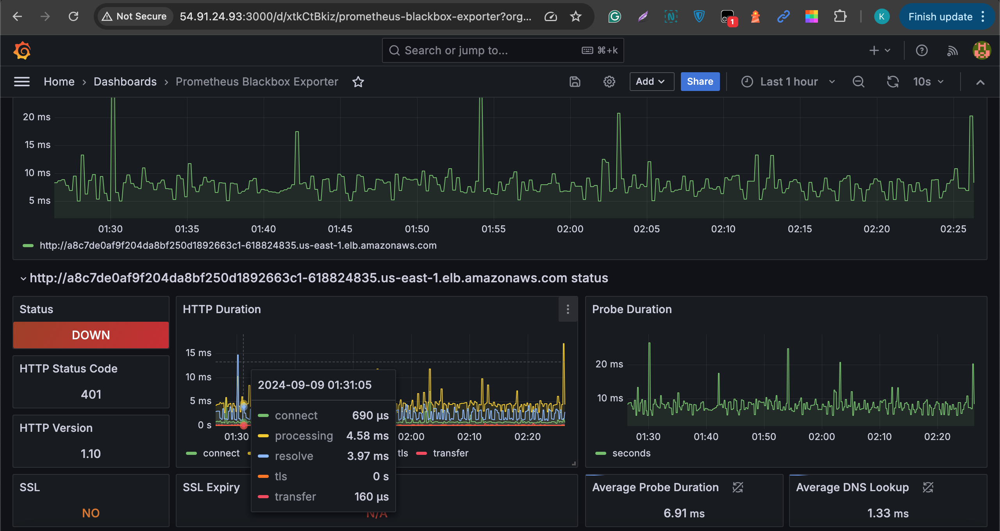

# RegTech Bank App Deployment Pipeline
- This guide outlines the Jenkins pipeline stages used to deploy the RegTech Bank App. The pipeline automates the deployment process from code checkout to Kubernetes deployment verification while ensuring compliance with security standards such as GDPR and PCI-DSS.
- Application deployment includes AWS EKS, EC2, Terraform, Kubernetes, Sonarqube, Nexus and Jenkins
- Creating Kubernetes Cluster with two nodes
- Using Terraform to Create Cluster, VPC, Security Group and IAM Role
- deployment includes monitoring using Prometheus and Grafana for application performance and security insights
- Prerequisites
- Java Development Kit (JDK)
- Docker
- Jenkins
- SonarQube
- Nexus Repository Manager
- Terraform
- AWS Account
- Prometheus
- Grafana
#### Access to the Git repository
SonarQube instance configured in Jenkins for code quality and security scans
Nexus Repository for publishing artifacts
Docker Registry for storing Docker images
Kubernetes cluster for application deployment
Compliance with Security Standards
This deployment pipeline ensures compliance with GDPR and PCI-DSS by integrating security checks and tools throughout the stages, including static code analysis, vulnerability scanning, and secure artifact management. Each stage of the pipeline contributes to security by validating code quality, detecting potential security vulnerabilities, and ensuring sensitive data is handled appropriately.

### Pipeline Stages
The deployment pipeline consists of the following stages:

1. Git Checkout
Purpose: Pulls the latest code from the Git repository.
Compliance Focus:
GDPR: Ensures that only authorized personnel have access to the code repository through proper access control mechanisms.
PCI-DSS: Version control ensures that changes to code are tracked, enabling traceability and auditing, which is crucial for PCI-DSS compliance.

2. Compile
Purpose: Compiles the Java code to check for syntax errors and resolves dependencies.
Compliance Focus:
GDPR: Compilation ensures that all necessary security libraries (such as encryption libraries) are correctly included in the build.
PCI-DSS: Ensures secure coding practices by resolving dependencies that are compliant with PCI-DSS requirements.

3. Test Java
Purpose: Executes unit tests to verify that the application functions as expected.
Compliance Focus:
GDPR & PCI-DSS: Automated tests ensure that core functionalities, including data handling and encryption, are working as expected. Unit tests help identify issues early, which contributes to secure development practices.

4. Trivy FS Scan
Purpose: Performs a Trivy filesystem scan to detect security vulnerabilities in the project files.
Compliance Focus:
GDPR: Detects vulnerabilities in libraries or configurations that may lead to personal data breaches.
PCI-DSS: Scanning for vulnerabilities ensures that the application doesn't contain insecure components or configurations, satisfying PCI-DSS 6.1 and 6.2 requirements (protect systems and software from known vulnerabilities).

5. SonarQube Analysis
Purpose: Performs static code analysis using SonarQube to identify bugs, vulnerabilities, and code quality issues.
Compliance Focus:
GDPR: Ensures that code handling personal data is secure, preventing potential data breaches.
PCI-DSS: SonarQube checks for secure coding practices, such as proper encryption and access control, in compliance with PCI-DSS section 6.3 (develop software based on industry best practices).

6. Build
Purpose: Builds the application and packages it into a JAR/WAR file.

7. Publish to Nexus
Purpose: Publishes the build artifact (JAR/WAR) to Nexus Repository.

Compliance Focus:
GDPR: The artifact repository is secured with role-based access control to ensure that only authorized personnel can upload or download artifacts.
PCI-DSS: By publishing to a repository, the artifacts are version-controlled and audited, ensuring compliance with the PCI-DSS requirement of secure artifact management (sections 6.4 and 10.2).

8. Docker Build Image
Purpose: Builds a Docker image from the application.
Compliance Focus:
GDPR: Ensures that the Docker image is securely built, containing only the necessary software and configurations to protect personal data.

9. Trivy Image Scan
Purpose: Scans the built Docker image for vulnerabilities using Trivy.
Compliance Focus:
GDPR: Detects security vulnerabilities in the Docker image that could lead to a data breach.
PCI-DSS: Ensures that no vulnerabilities exist within the Docker image that could compromise cardholder data, helping to meet PCI-DSS requirements 5.2 and 6.1.

10. Docker Push Image
Purpose: Pushes the Docker image to a container registry.
Compliance Focus:
GDPR & PCI-DSS: The Docker registry must be secured with proper authentication and encryption to ensure the integrity and confidentiality of the Docker images. Only authorized users should be allowed to push/pull images, satisfying the access control requirements under GDPR and PCI-DSS.

11. Deploy to Kubernetes
Purpose: Deploys the Docker image to a Kubernetes cluster.
Compliance Focus:
GDPR: Ensures that personal data is stored and handled securely within the Kubernetes cluster.
PCI-DSS: Kubernetes configurations should ensure that proper security mechanisms like encryption, network segmentation, and access control are applied, adhering to PCI-DSS requirements 2.2, 3.4, and 7.

12. Verify Deployment
Purpose: Verifies the deployment by checking the status of the Kubernetes pods and ensures the application is running correctly.
Compliance Focus:
GDPR & PCI-DSS: Ensures the application is correctly deployed and configured in a secure environment. Verification of the deployment ensures that security controls are functioning as expected and that there are no configuration issues that could lead to data breaches or non-compliance.
##### Monitoring with Prometheus and Grafana
- Below is a screenshot monitoring matrix of the application deployed into AWS using Prometheus and Grafana

13. Setup Prometheus for Monitoring
Integrates Prometheus for monitoring application metrics and Kubernetes cluster health.
- Prometheus monitoring and Blackbox exporter configuration to scrape application metrics.
The application exposes necessary metrics for monitoring (e.g., response time, CPU usage, memory consumption).
Compliance:
GDPR & PCI-DSS: Monitoring is done to ensure the infrastructure and application remain secure, without exposing sensitive data. Prometheus should be secured to prevent unauthorized access.
14. Grafana Dashboard for Metrics Visualization
Description: Visualizes the metrics collected by Prometheus in Grafana dashboards.
- Grafana is set up to retrieve data from Prometheus.
Custom dashboards are created to visualize key performance indicators (KPIs), including application health, request rates, and error rates.
Alerts can be configured in Grafana to notify of any compliance-related incidents, such as data breaches or performance degradation.

Conclusion
By following this Jenkins pipeline, you can automate the build, security scans, and deployment of the RegTech Bank App to Kubernetes while maintaining compliance with GDPR and PCI-DSS. This process integrates security at every stage, ensuring that the application meets the highest standards for privacy and data protection.
